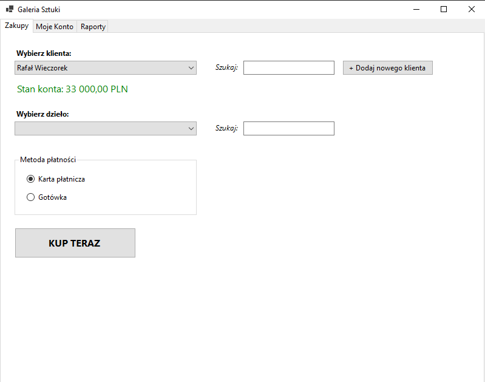
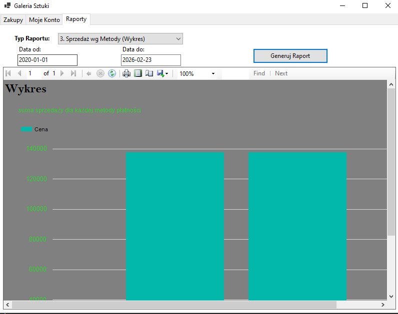
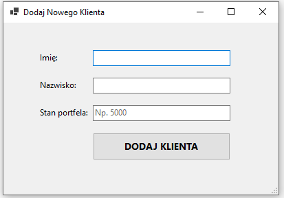

# GaleriaSztuki-UniversityProject
Art gallery management system — WinForms desktop app for browsing artworks, purchasing pieces and generating RDLC reports. Built with C#/.NET 8 and PostgreSQL.

## Screenshots

### Main Window


### Reports


### New Client Registration


## Features

- **Client Management** — Add and search clients with wallet balance tracking
- **Artwork Browsing** — Search available artworks by name, view artist (with pseudonym support)
- **Purchase System** — Buy artworks via card or cash with full transaction support (rollback on failure)
- **Purchase History** — View all past purchases per client
- **RDLC Reports** — 4 report types:
  - Purchase History (Table)
  - Artworks by Artist (Grouping)
  - Sales by Payment Method (Chart)
  - Purchase Certificate (Form)

## Tech Stack

| Component | Technology |
|-----------|------------|
| Language | C# (.NET 8) |
| UI | Windows Forms |
| Database | PostgreSQL |
| DB Driver | Npgsql 10.0 |
| Reports | ReportViewerCore (RDLC) |

## Database Schema

| Table | Description |
|-------|-------------|
| `galeria` | Galleries (name, city) |
| `artysta` | Artists (name, surname) |
| `pseudonim` | Artist pseudonyms and art type |
| `klient` | Clients (name, surname, wallet balance) |
| `pracownik` | Employees with supervisor hierarchy |
| `wystawa` | Exhibitions |
| `dzielo_sztuki` | Artworks (title, price, dimensions) |
| `magazyn` | Inventory items per gallery |
| `transakcja` | Transactions (artwork, client, date) |
| `tranzakcja_karta` | Card payment details |
| `tranzakcja_gotowka` | Cash payment details |

## Setup

1. **Clone the repository:**
   ```bash
   git clone https://github.com/OlivierGawronek/GaleriaSztuki-UniversityProject.git
   cd GaleriaSztuki-UniversityProject
   ```

2. **Set up the database:**
   ```bash
   psql -U postgres -f sql/schema.sql
   psql -U postgres -f sql/seed.sql
   ```

3. **Configure the connection string:**
   ```bash
   cp appsettings.template.json appsettings.json
   ```
   Edit `appsettings.json` with your PostgreSQL credentials.

4. **Run the application:**
   ```bash
   dotnet run
   ```

## Project Structure

```
├── Program.cs                # Application entry point
├── MainForm.cs               # Main window (shopping, history, reports tabs)
├── Form1.cs                  # Client registration form
├── DbHelper.cs               # Database connection and query helper
├── UserSession.cs             # Current user session state
├── ReportViewerForm.cs        # Report viewer window
├── GalleryData.xsd            # Typed DataSet schema for RDLC reports
├── RaportKlienta.rdlc         # Report: Purchase history (table)
├── RaportGrupowanie.rdlc      # Report: Artworks by artist (grouping)
├── RaportWykres.rdlc          # Report: Sales chart
├── RaportFormularz.rdlc       # Report: Purchase certificate (form)
├── screenshots/               # Application screenshots
├── sql/
│   ├── schema.sql             # Database schema
│   └── seed.sql               # Sample data (15 artists, 15 clients, 30 transactions)
└── appsettings.template.json  # Connection string template
```

## License

[MIT](LICENSE)